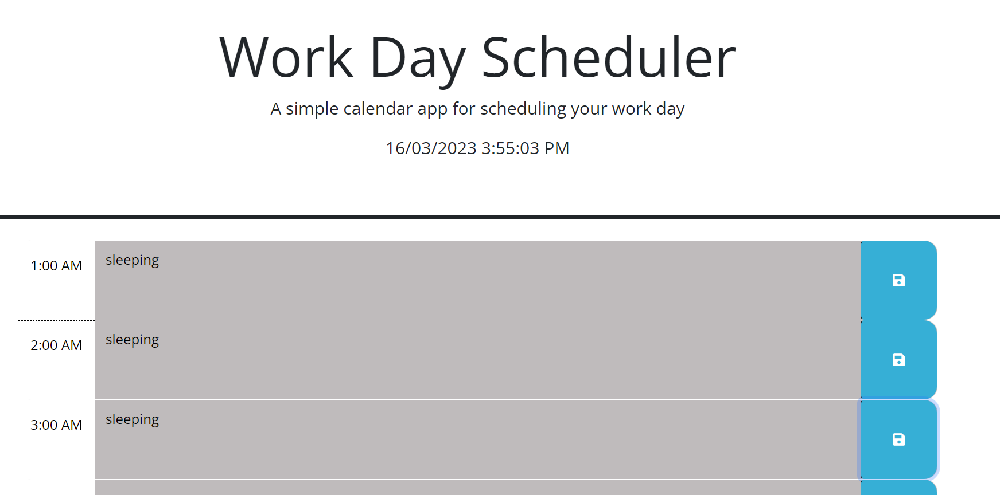

# Daily-Planner

## Description
Simply enter your notes in any of the hour textbox's and click the save icon and the note is saved for future reference.
Each Hour is color coded to let you know if it is past present or future.
The grey color means the time frame has passed, the red color means present hour and the green color means future time frames.

## Images
<u>Example of past time frames.</u>

 
 
<u>Example of past, present and future time frames</u>

 
 

## Author
Name: Andrew Clark 
Email: andy@mail.com 
linkedIn: andy@linkedIn.com
## Link
Please click the link below to view the project. 
<a href="https://andy316c.github.io/Daily-Planner/">Daily Planner</a>

